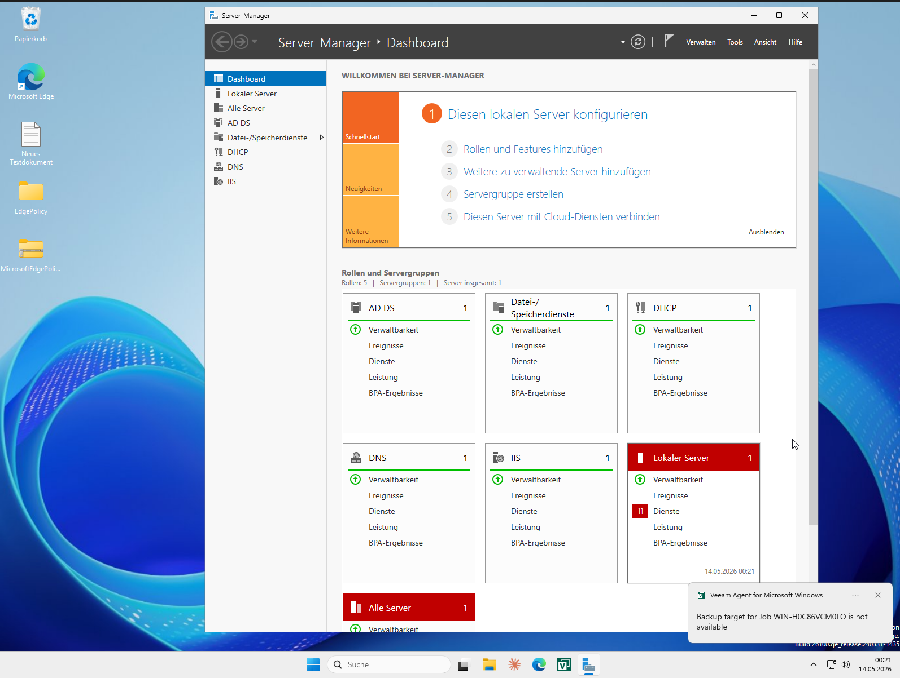
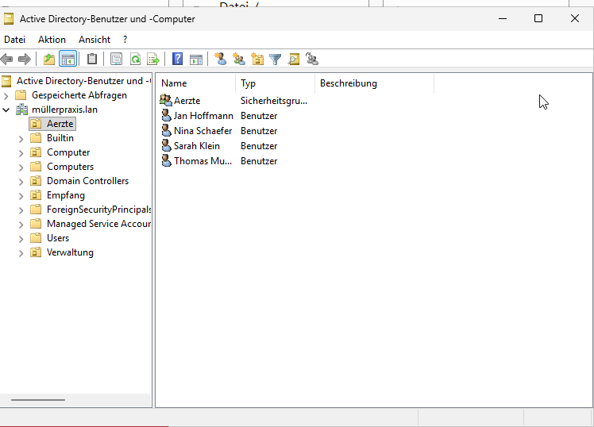
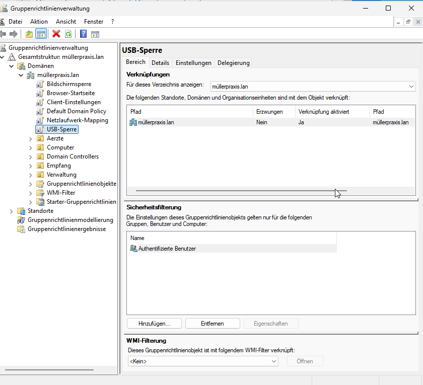
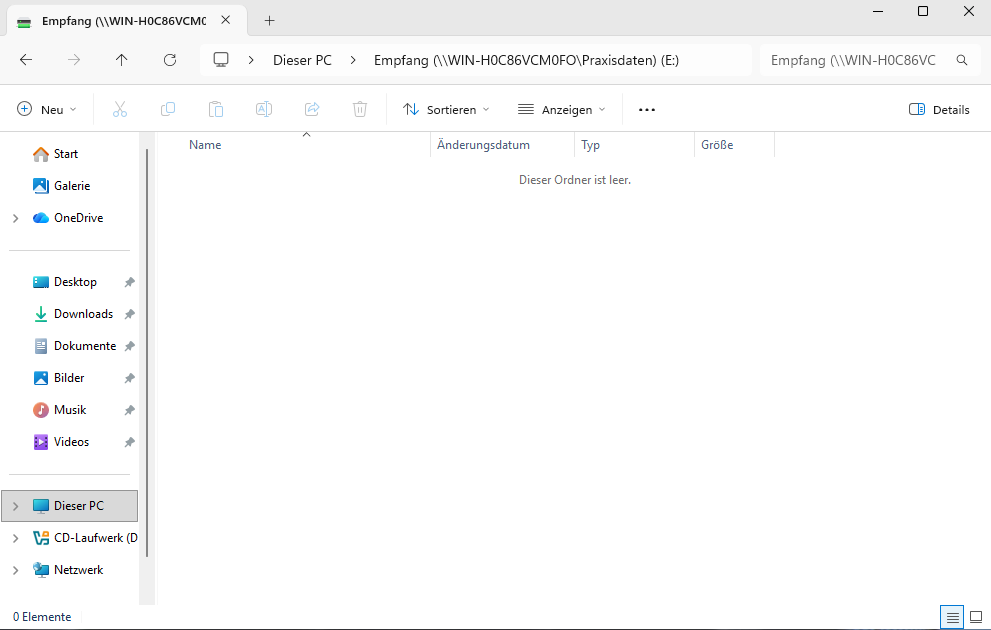
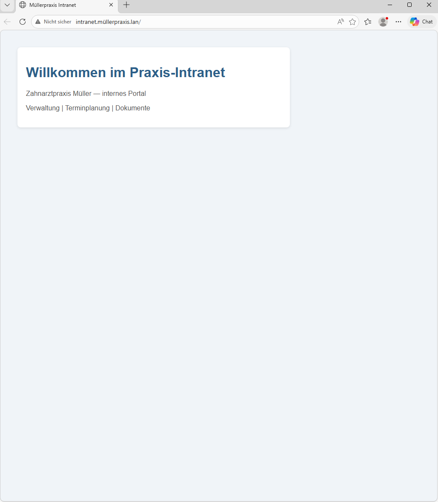
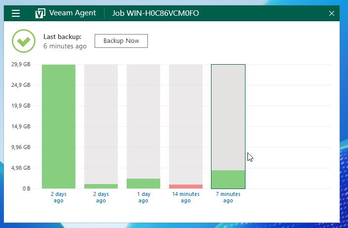

# Zahnarztpraxis-Lab

Homelab Setup einer fiktiven Zahnarztpraxis. Windows Server 2025 als Domain Controller, Win11 Pro Client, GPOs, IIS, Veeam. Komplett selbst aufgebaut, parallel zum Schichtbetrieb.

Ziel: nachweisen, dass ich die Aufgaben kann, die in einem MSP-Junior-Job auf dem Tisch landen.

---

## Szenario

Fiktive Praxis "Müller" mit 5 Abteilungen (Ärzte, Empfang, Verwaltung, Behandlung, Abrechnung) und 10 Mitarbeitern. Windows Server 2025 als DC mit Active Directory, DNS, DHCP und IIS. Ein Windows 11 Pro Client in die Domain gehängt.

---

## Was umgesetzt ist

- Active Directory mit 5 OUs und 10 Usern
- DNS und DHCP konfiguriert
- 4 GPOs: USB-Sperre, Bildschirmsperre, Browser-Startseite, Netzlaufwerk-Mapping
- Netzlaufwerke per Logon-Script gemappt, jede Abteilung sieht nur ihren eigenen Ordner
- IIS Intranet unter `intranet.müllerpraxis.lan`
- Veeam Agent Community konfiguriert, File-Level-Backup und Restore getestet
- 10 User per PowerShell aus CSV angelegt (siehe `scripts/`)

---

## Screenshots

| Server-Manager | Active Directory |
|---|---|
|  |  |

| GPO-Übersicht | Drive Mapping |
|---|---|
|  |  |

| Intranet | Veeam Backup |
|---|---|
|  |  |

---

## Scripts

| Script | Zweck |
|---|---|
| `DriveMapping.ps1` | Mappt beim Login das richtige Netzlaufwerk je nach AD-Gruppe |
| `Lab-Trouble-Maker.ps1` | Break/Fix-Übungen, simuliert typische Fehlerszenarien im Lab (WIP) |

---

## Was hängen geblieben ist

- DNS frisst keine Umlaute. `müllerpraxis.lan` läuft intern über die Punycode-Variante `xn--mllerpraxis-r8a.lan`. Im Lab interessant zu lösen, in Produktion: keine Umlaute in internen Domains, fertig.
- GPOs greifen erst nach `gpupdate /force` oder Neuanmeldung. Spart eine Stunde Sucherei, wenn man das direkt weiß.
- Veeam Community macht nur File-Level-Backup, kein Bare-Metal-Restore. Fürs Lab reicht das, für Kunden braucht es die bezahlte Version oder einen anderen Stack.
- Drive Mapping per Logon-Script statt GPP. Mit GPP wirds bei überlappenden Gruppen mit Item-Level Targeting und Replace-Action schnell fehleranfällig. Im Script bündele ich die Logik zentral und debugge per Logfile.

---

## Was als nächstes kommt

- Ubuntu Samba mit AD-Integration als File-Server
- Lab-Trouble-Maker fertig schreiben und dokumentieren

---

## Tech Stack

- VirtualBox
- Windows Server 2025
- Windows 11 Pro
- PowerShell 5.1
- Veeam Agent for Microsoft Windows (Community Edition)

---

## Zertifizierungen

| Cert | Status |
|---|---|
| AZ-900 Azure Fundamentals | In Vorbereitung |
| MD-102 Endpoint Administrator | Geplant |
| AZ-802 Windows Server Hybrid Administrator | Geplant (Live ab August 2026) |

---

## Kontakt

- Website: [murphy-it.de](https://murphy-it.de)
- E-Mail: *[hier eintragen]*
- Xing: *[hier eintragen]*

---

## Über mich

Thomas Murphy. CNC-Schleifer im Drei-Schicht-Betrieb in Oberschwaben, parallel auf dem Weg in die IT.

Homelab, Microsoft-Zertifizierungen, Portfolio. Suche eine Junior-Stelle bei einem MSP in der Region Biberach, Laupheim, Schwendi.
